# SVD Recommendation on MovieLens 100K

**Albert Kabore | Hyperparameter Tuning and Final Model Evaluation**

## 1. Hyperparameter Tuning

### 1.1 Search Design and Candidate Configurations

- **Training-only search:** SVD was tuned with Surprise's GridSearchCV (Hug, 2020) using only the 80,000-rating training partition. All searches used the same three seeded validation folds; the 20,000 test ratings were excluded from selection.
- **Assignment grid, exactly as specified:** `{'n_factors': [50, 100], 'n_epochs': [20, 40], 'lr_all': [0.002, 0.005]}`. Regularization remained at its default, 0.02.
- **Search results:** The 8-candidate assignment search selected `(50, 20, 0.005, 0.02)`, with CV RMSE 0.9502. The 54-candidate expanded search selected `(150, 40, 0.01, 0.1)`, scoring 0.9306. The 81-candidate refined search selected `(200, 80, 0.01, 0.15)`, scoring 0.9294. Settings are listed as factors, epochs, learning rate, and regularization. The default configuration scored 0.9534 on the same folds.
### 1.2 Sensitivity and Selection Limits

- **Sensitivity and limits:** Regularization had the largest sensitivity in both larger grids: ranges of mean CV RMSE of 0.0235 and 0.0079, respectively. The selected model still reaches three refined-grid boundaries: maximum factors (200), maximum epochs (80), and minimum learning rate (0.01). It is the **best configuration tested**, not a proven optimum.
- **Evidence:** `tuning_assignment.json`, `tuning_expanded.json`, `tuning_refined.json`, `tuning_selected.json`, and the corresponding `tuning_surface_*.csv` files. Supporting plots appear in the appendix.

## 2. Final Model Evaluation

### 2.1 Rating Accuracy and Error Patterns

- **Rating accuracy:** After fitting on the full training partition, tuned SVD achieved test RMSE **0.921** and MAE **0.729**, compared with **0.941** and **0.741** for default SVD. The reductions were 0.0198 RMSE (2.11%) and 0.0123 MAE. Training RMSE was 0.791, giving a train-test gap of 0.131.
- **Actual versus predicted ratings:** Predictions were compressed toward the mean: prediction standard deviation was 0.58, compared with 1.13 for actual ratings. Actual ratings of 1 were predicted at 2.77 on average, while ratings of 5 were predicted at 3.97. Low ratings were overpredicted and high ratings underpredicted; errors were generally larger away from the middle of the scale.
- **Where errors were larger:** The lowest user-support group of test ratings, associated with users having 11-59 training ratings, had RMSE 0.965. The lowest movie-support group, involving movies with 0-48 training ratings, had RMSE 0.982. These are approximately equal-sized groups of test ratings, not fifths of distinct users or movies. Additional information or stronger shrinkage for sparse profiles could be evaluated using training-based validation.
### 2.2 Ranking Quality and Candidate-Set Limitations

- **Precision and recall:** Precision@10 fell from 0.619 to 0.596, and recall@10 from 0.282 to 0.261. For each user, candidates were restricted to held-out rated items. A recommendation had to rank among the ten highest predictions and have a predicted rating **at least 4**; relevance required an actual rating **at least 4**. Metrics were averaged over 942 users. No qualifying recommendations meant zero precision; no relevant items meant zero recall.
- **Interpreting the decline:** Selection minimized CV RMSE rather than ranking error. Compressed predictions can leave relevant items below the cutoff, reducing recall. Precision depends on which items cross the cutoff and on users receiving no qualifying recommendations. These are possible contributors, not experimentally isolated causes. The separate catalog-wide lists rank training-known movies the user has not rated in training, without the cutoff of 4; their exposure statistics are not the reported precision and recall.
### 2.3 Temporal Validity and Statistical Uncertainty

- **Chronological limitations:** RMSE increased to 0.972 under per-user chronology and 1.021 under a global chronological split. Per-user chronology still permits later ratings from other users: 94.4% of test ratings concerned movies with later training ratings. The global split removes this later-dated information, but 85.2% of test ratings come from unseen users, making cold start a major influence. These comparisons do not isolate leakage and illustrate the importance of evaluation protocols (Campos et al., 2014).
- **Uncertainty and evidence:** A CV standard deviation is **not a significance test** for test improvement. Results come from `final_evaluation.json`, `final_*.csv`, and `temporal_summary.json`; the appendix contains the detailed comparisons and visualizations.

## References

Campos, P. G., Díez, F., & Cantador, I. (2014). Time-aware recommender systems: A comprehensive survey and analysis of existing evaluation protocols. *User Modeling and User-Adapted Interaction, 24*(1-2), 67-119. https://doi.org/10.1007/s11257-012-9136-x

Hug, N. (2020). Surprise: A Python library for recommender systems. *Journal of Open Source Software, 5*(52), Article 2174. https://doi.org/10.21105/joss.02174

## Appendix: Supporting Report Figures

- The report sections above address the group instructions. The appendix preserves the detailed evidence and notebook visualizations; it is excluded from the main section length targets.

### Sensitivity of Cross-Validated RMSE to Each Hyperparameter in the Assignment Grid

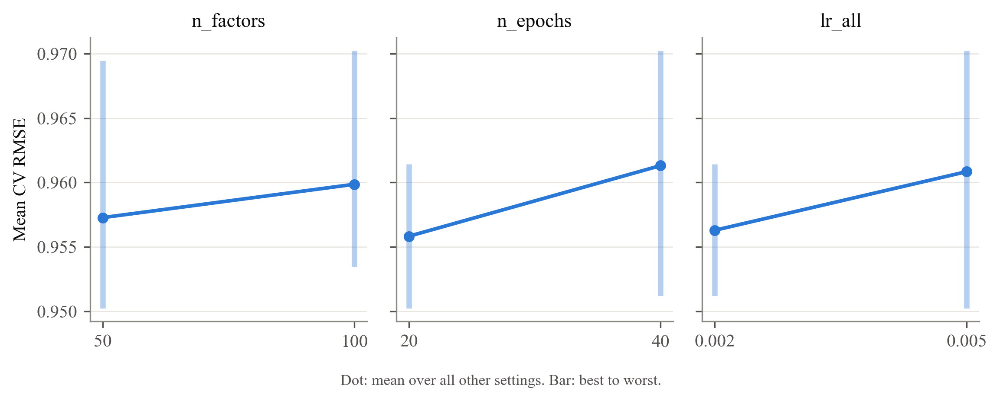

### Sensitivity of Cross-Validated RMSE to Each SVD Hyperparameter in the Expanded Grid

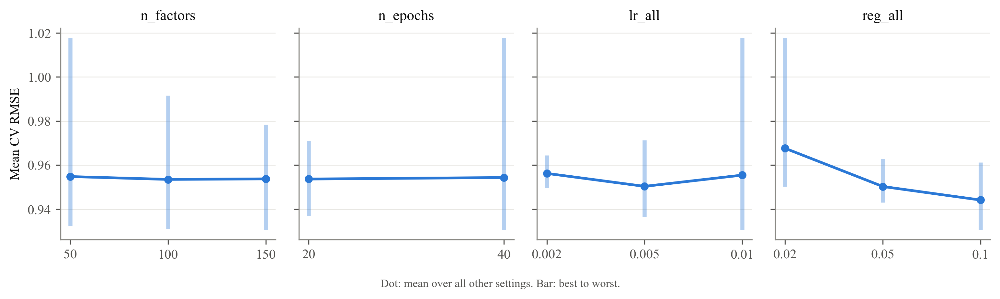

### Sensitivity of Cross-Validated RMSE to Each SVD Hyperparameter in the Refined Grid

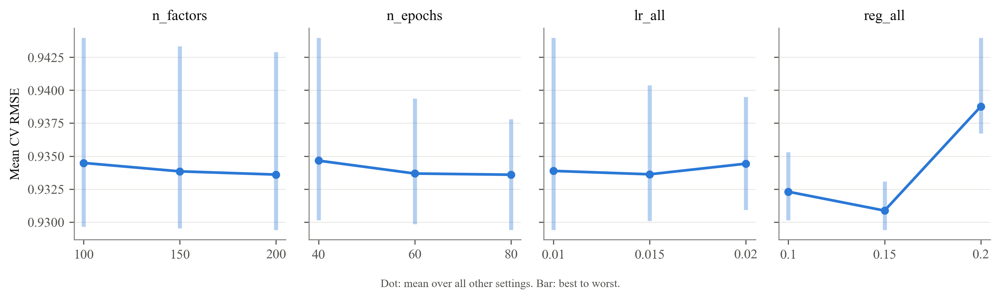

### Predicted Versus True Ratings for the Tuned SVD on the Test Set

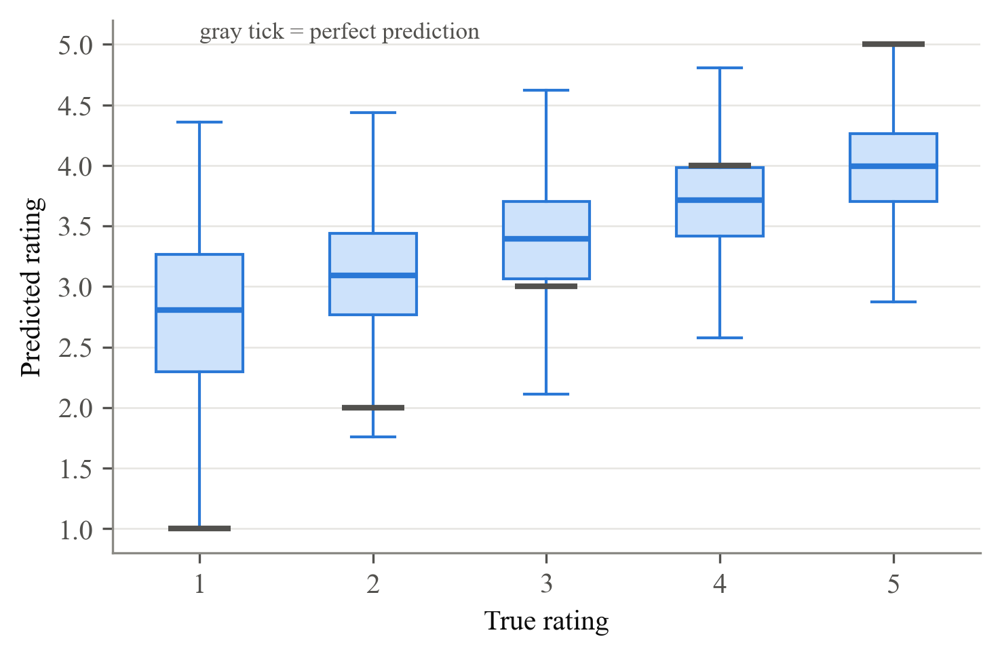

### Tuned SVD Test RMSE by Users' and Movies' Number of Training Ratings

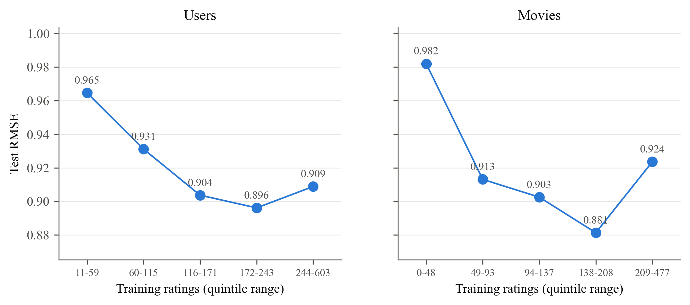

### Test RMSE of the Tuned SVD and the Bias-Only Baseline Under Three Train/Test Splits

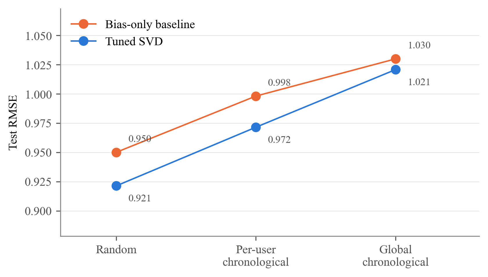

## Detailed Notebook Analysis and Visualizations

### Evidence and Interpretation

- Reported measurements are drawn from the project result files or explicitly identified notebook recomputations. No synthetic observations are substituted for MovieLens ratings.
- The local MovieLens files passed the project's dataset-count and SHA-256 checks. Tuned test RMSE and MAE were independently recalculated from the 20,000 saved test predictions and matched the evaluation summary.
- Candidate counts and best CV scores were checked against the saved search surfaces. Ranking metrics and chronological RMSE were cross-checked between the saved CSV and JSON files. These consistency checks do not constitute a fresh execution of every search.
- Suggested mechanisms and potential improvements are hypotheses, not established causal findings. Fold standard deviations are not significance tests, and neither the best tested configuration nor the random-split score establishes optimal deployment performance.

- Tuning figures use saved search surfaces. Evaluation figures were rendered from the frozen splits and checked against saved results. V16 uses the saved tuned recommendation lists to maintain consistency with the report; default-model lists were recomputed.

- Figure labels V1-V17 match the notebook. Eighteen images cover those groups because V5 contains two figures. Six additional report figures appear above.

### 1. Hyperparameter Tuning

#### 1.1 Experimental Design and Test-Set Protection

The assignment specifies the following search:

```python
from surprise.model_selection import GridSearchCV
param_grid = {'n_factors': [50, 100], 'n_epochs': [20, 40], 'lr_all': [0.002, 0.005]}
grid_search = GridSearchCV(SVD, param_grid, measures=['rmse'], cv=3)
grid_search.fit(data_surprise)
```

This notebook preserves the assignment grid and makes the evaluation reproducible:

- **Training data only:** `data_surprise` contains the 80,000 training ratings. The 20,000 test ratings are excluded from hyperparameter selection.
- **Identical validation folds:** Each search uses `KFold(3, shuffle=True, random_state=42)`, so every candidate is evaluated on the same three folds.
- **Consistent model initialization:** Each SVD model uses `random_state=42`.
- **Selection criterion:** Both RMSE and MAE are recorded, but the configuration with the lowest mean CV RMSE is selected.

Using the full dataset in `grid_search.fit()` would allow test ratings to influence model selection. Restricting the search to the training partition prevents that leakage.

#### 1.2 Assignment Grid: Baseline Search across Eight Configurations

The assignment grid combines two values each for `n_factors`, `n_epochs`, and `lr_all`, producing eight candidates. Regularization remains fixed at Surprise's default, `reg_all = 0.02`.

The default SVD configuration (100 factors, 20 epochs, a learning rate of 0.005, and regularization of 0.02) is included. Its CV score provides a reference evaluated on the same folds as the other candidates.

| Model / Group | n_factors | n_epochs | lr_all | cv_rmse | cv_rmse_sd | rank_test_rmse | cv_mae | std_test_mae | mean_fit_time |
| --- | --- | --- | --- | --- | --- | --- | --- | --- | --- |
| 0 | 50 | 20 | 0.005 | 0.9502230598981622 | 0.000229155328216 | 1 | 0.7505191241374399 | 0.0014118409794396 | 0.2577172915140788 |
| 1 | 50 | 40 | 0.002 | 0.9512052613107108 | 0.0002410425183716 | 2 | 0.7519585782065336 | 0.0010029865062265 | 0.4969997406005859 |
| 2 | 100 | 20 | 0.005 | 0.9534441483507872 | 0.0002030622843068 | 3 | 0.7535723624754596 | 0.0015191970873894 | 0.4714795748392741 |
| 3 | 100 | 40 | 0.002 | 0.9543315055863943 | 0.0001799182631587 | 4 | 0.7548730075155342 | 0.0013092371958497 | 0.911299467086792 |
| 4 | 50 | 20 | 0.002 | 0.9582029372256544 | 0.0011231731066602 | 5 | 0.7597357281915554 | 0.0001740158780391 | 0.2800540129343669 |
| 5 | 100 | 20 | 0.002 | 0.9614157937604556 | 0.0008433377500738 | 6 | 0.7624244821011902 | 0.0002919209664973 | 0.432289441426595 |
| 6 | 50 | 40 | 0.005 | 0.9694514969177828 | 0.0007046541484207 | 7 | 0.7610171765864765 | 0.0007938746431593 | 0.510108470916748 |
| 7 | 100 | 40 | 0.005 | 0.9702442641735186 | 0.00058195576432 | 8 | 0.7646484420940977 | 0.0011924364933749 | 0.8718652725219727 |

##### V1. Assignment grid: all 8 candidates (orange = Surprise's defaults)

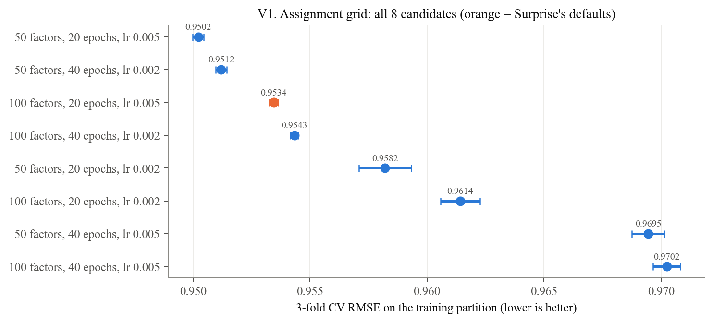

##### Observations: V1 and V2: Assignment Grid

- The best candidate uses 50 factors, 20 epochs, and a learning rate of 0.005, with regularization fixed at 0.02.
- Its mean CV RMSE is 0.9502, compared with 0.9534 for the default configuration: a reduction of 0.0032.
- Averaged over the other settings, the higher value of each searched parameter increases CV RMSE. These averages do not imply that every individual combination follows the same pattern.
- The results are consistent with overfitting in some configurations, but validation scores alone do not establish the cause.
- The error bars show variation across validation folds. Their overlap is not a significance test.

##### V2. Assignment grid sensitivity   (dot = mean over the other settings, bar = best to worst)

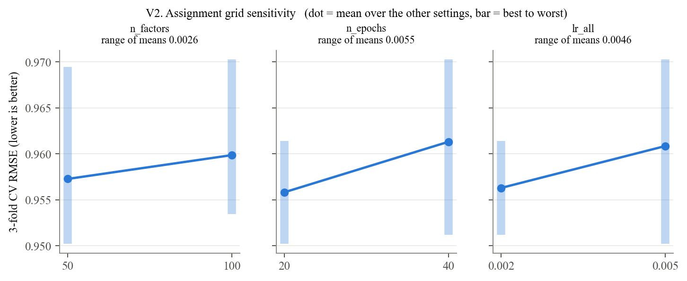

#### 1.3 Expanded Grid: Regularization and Parameter Interactions

The expanded grid varies `reg_all` and increases the ranges of the factor count and learning rate. It retains the two epoch values from the assignment grid. The resulting 54 candidates test whether additional regularization improves performance and changes the effects of the other parameters.

| Model / Group | n_factors | n_epochs | lr_all | reg_all | cv_rmse | cv_rmse_sd | rank_test_rmse | cv_mae | std_test_mae | mean_fit_time |
| --- | --- | --- | --- | --- | --- | --- | --- | --- | --- | --- |
| 0 | 150 | 40 | 0.01 | 0.1 | 0.930595321491664 | 0.0005636759106386 | 1 | 0.7363120853340032 | 0.000883586746357 | 1.4231898784637451 |
| 1 | 100 | 40 | 0.01 | 0.1 | 0.9310612503589444 | 0.000599023229198 | 2 | 0.7364804517224619 | 0.0008455342127765 | 1.089409589767456 |
| 2 | 50 | 40 | 0.01 | 0.1 | 0.9323766054853286 | 8.781485014572661e-05 | 3 | 0.7362048512051015 | 0.0008764104366121 | 0.5804121494293213 |
| 3 | 150 | 40 | 0.005 | 0.1 | 0.9365926089980858 | 0.0006959580533533 | 4 | 0.7417282238330963 | 0.0013916004731139 | 1.924377679824829 |
| 4 | 100 | 40 | 0.005 | 0.1 | 0.9367067555622712 | 0.0001540916374121 | 5 | 0.741875018794794 | 0.0012147335572144 | 1.0054854551951091 |
| 5 | 150 | 20 | 0.01 | 0.1 | 0.9368408980472857 | 0.0008179099125671 | 6 | 0.7420079062710768 | 0.0015045457372101 | 0.7089536984761556 |
| 6 | 100 | 20 | 0.01 | 0.1 | 0.937040172675727 | 0.0002088967408179 | 7 | 0.742217303977038 | 0.0012894083508988 | 0.4613115787506103 |
| 7 | 50 | 40 | 0.005 | 0.1 | 0.938822760944116 | 0.0004914560987705 | 8 | 0.7431666083311564 | 0.0015565763528767 | 0.56740403175354 |
| 8 | 50 | 20 | 0.01 | 0.1 | 0.9392429565310488 | 0.0006495845998776 | 9 | 0.7436428053275135 | 0.0016654296347751 | 0.2818233172098796 |
| 9 | 50 | 20 | 0.01 | 0.05 | 0.9429922954131218 | 0.0001622587621094 | 10 | 0.7431423850142501 | 0.0013236456453239 | 0.2814641793568929 |

##### V3. Expanded grid sensitivity   (dot = mean over the other settings, bar = best to worst)

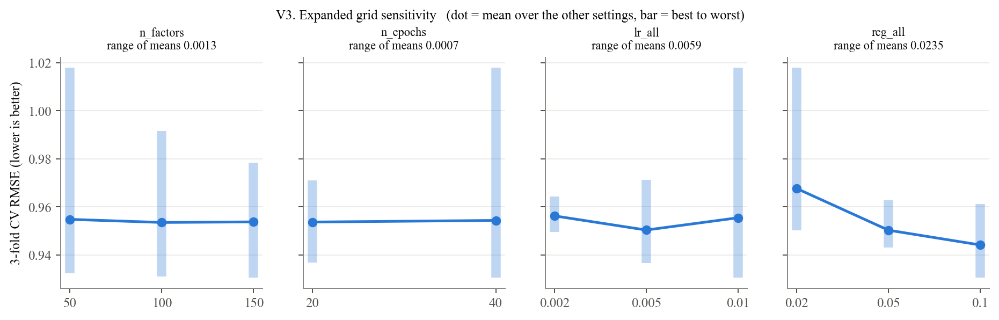

##### V4a. Best CV RMSE: reg_all x lr_all; V4b. Best CV RMSE: reg_all x n_epochs

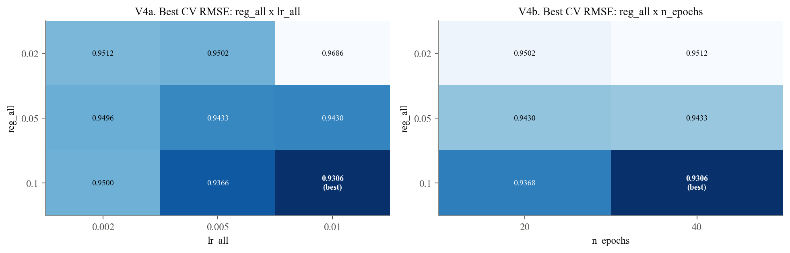

##### Observations: V3 and V4: Expanded Grid

- Regularization has the largest sensitivity across the tested values. Its range of mean CV RMSE is 0.0235, compared with 0.0059 for the learning rate.
- The heatmaps show that the effects of learning rate and training duration depend on regularization. Each heatmap cell reports the best score over the remaining parameters.
- The best configuration uses 150 factors, 40 epochs, a learning rate of 0.01, and regularization of 0.1. Its mean CV RMSE is 0.9306.
- All four selected values lie at the upper boundaries of the expanded grid. This motivates testing values beyond those boundaries.
- Because the expanded grid changes several parameters, the total improvement cannot be attributed solely to regularization.

#### 1.4 Refined Grid: Local Sensitivity and Search Boundaries

The refined grid tests three values for each of the four hyperparameters. It includes the expanded-grid winner and extends each parameter beyond that winner. All 81 candidates use the same three training folds.

| Model / Group | n_factors | n_epochs | lr_all | reg_all | cv_rmse | cv_rmse_sd | rank_test_rmse | cv_mae | std_test_mae | mean_fit_time |
| --- | --- | --- | --- | --- | --- | --- | --- | --- | --- | --- |
| 0 | 200 | 80 | 0.01 | 0.15 | 0.9294087585759812 | 0.0003191619328351 | 1 | 0.736850394189581 | 0.0007815711614857 | 5.555819749832153 |
| 1 | 150 | 80 | 0.01 | 0.15 | 0.9295216295766554 | 7.799304946593547e-05 | 2 | 0.7368440472108649 | 0.0006516010104684 | 3.983319123586019 |
| 2 | 100 | 80 | 0.01 | 0.15 | 0.9296631074500192 | 0.0001733292173051 | 3 | 0.7369739182869649 | 0.0007743454557124 | 2.506086190541585 |
| 3 | 200 | 60 | 0.01 | 0.15 | 0.929839110342917 | 0.0003036404554429 | 4 | 0.7373390334222153 | 0.0008339247618944 | 4.779825448989868 |
| 4 | 150 | 60 | 0.01 | 0.15 | 0.9300150745668834 | 0.0001345251505722 | 5 | 0.7373526457564562 | 0.0007304683052167 | 2.614550749460856 |
| 5 | 200 | 60 | 0.015 | 0.15 | 0.930099901404739 | 0.0002513906741978 | 6 | 0.7373833871564114 | 0.0008756568487742 | 5.557120323181152 |
| 6 | 100 | 60 | 0.01 | 0.15 | 0.9301521476185584 | 0.0002615804836765 | 7 | 0.7375023423238681 | 0.0007978206276691 | 1.6727801163991292 |
| 7 | 200 | 40 | 0.01 | 0.1 | 0.9301529071676464 | 0.0002403636399226 | 8 | 0.7361585463046801 | 0.0005177198870296 | 2.7900050481160483 |
| 8 | 200 | 60 | 0.01 | 0.1 | 0.9301608776362263 | 0.0002326586861386 | 9 | 0.7359515096125561 | 0.0004928972388155 | 4.351668119430542 |
| 9 | 150 | 60 | 0.015 | 0.15 | 0.930210385157383 | 0.0001952047101712 | 10 | 0.7373755209889223 | 0.0007805898473872 | 2.955880880355835 |

##### V5a. Refined grid sensitivity   (dot = mean over the other settings, bar = best to worst)

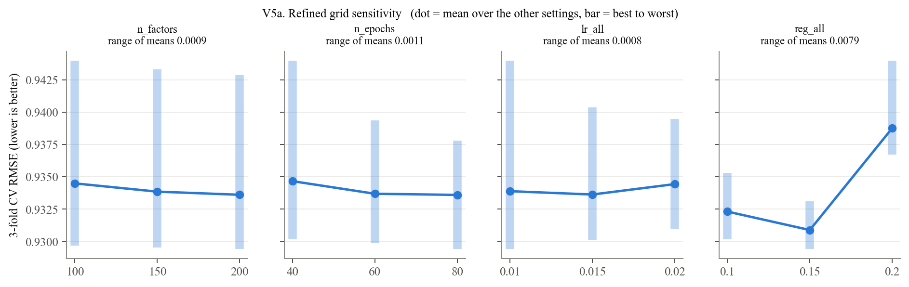

##### V5b. Best CV RMSE: reg_all x n_epochs; V5c. Best CV RMSE: reg_all x n_factors

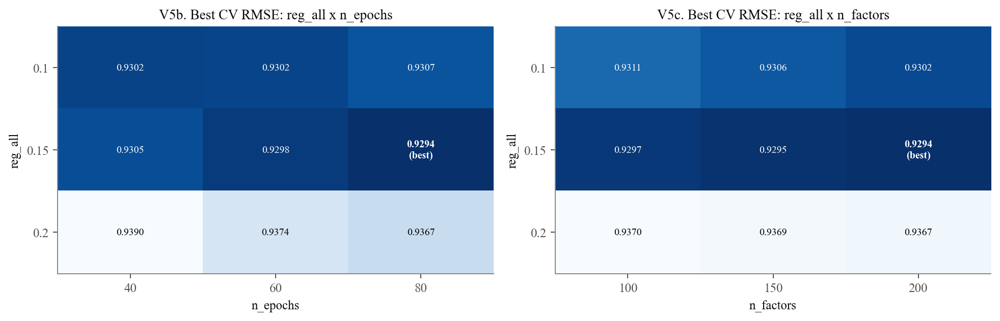

##### V6. Refined grid: 15 best candidates (orange = selected)

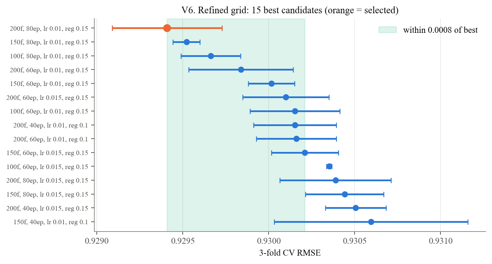

##### Observations: V5 and V6: Refined Grid

- Regularization again has the largest sensitivity: 0.0079 in mean CV RMSE, compared with 0.0011 or less for each other parameter.
- Regularization of 0.15 gives the lowest CV RMSE in 24 of the 27 combinations of the other settings. Regularization of 0.1 wins in the remaining three.
- The selected configuration uses 200 factors, 80 epochs, a learning rate of 0.01, and regularization of 0.15. Its mean CV RMSE is 0.9294.
- The ten best candidates span approximately 0.0008 CV RMSE. These similar observed scores do not establish statistical equivalence.
- The winner reaches three boundaries: the highest factor count, the highest epoch count, and the lowest learning rate in this grid.
- This is the **best configuration tested**. Performance beyond the tested boundaries remains unknown.

| Model / Group | grid | candidates | best CV RMSE | best settings | on edge | most sensitive |
| --- | --- | --- | --- | --- | --- | --- |
| 0 | assignment | 8 | 0.9502230598981622 | {'n_factors': 50, 'n_epochs': 20, 'lr_all': 0.005} | {'n_factors': 'lower', 'n_epochs': 'lower', 'lr_all': 'upper'} | n_epochs |
| 1 | expanded | 54 | 0.930595321491664 | {'n_factors': 150, 'n_epochs': 40, 'lr_all': 0.01, 'reg_all': 0.1} | {'n_factors': 'upper', 'n_epochs': 'upper', 'lr_all': 'upper', 'reg_all': 'upper'} | reg_all |
| 2 | refined | 81 | 0.9294087585759812 | {'n_factors': 200, 'n_epochs': 80, 'lr_all': 0.01, 'reg_all': 0.15} | {'n_factors': 'upper', 'n_epochs': 'upper', 'lr_all': 'lower'} | reg_all |

##### V7a. Every candidate (orange = best of each grid); V7b. Best CV RMSE after each search

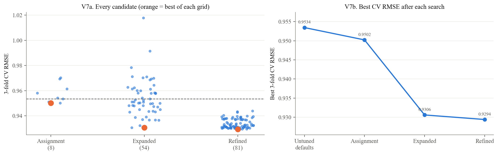

#### 1.5 Model Selection across the Three Searches

##### Observations: V7: Comparison of the Three Searches

- Mean CV RMSE decreases from 0.9534 for the defaults to 0.9502 for the assignment-grid winner, 0.9306 for the expanded-grid winner, and 0.9294 for the refined-grid winner.
- The largest improvement occurs between the assignment and expanded grids. Refinement provides a further reduction of approximately 0.0012.
- The three searches are directly comparable because they use the same training partition and validation folds.
- These three-fold CV scores should not be treated as equivalent to the five-fold CV scores in the model-selection table.
- The test set does not influence the selection of the final hyperparameters.

| Model / Group | n_factors | n_epochs | lr_all | reg_all | cv_rmse | cv_rmse_sd | rank_test_rmse | cv_mae | std_test_mae | mean_fit_time |
| --- | --- | --- | --- | --- | --- | --- | --- | --- | --- | --- |
| 0 | 200 | 80 | 0.01 | 0.15 | 0.9294087585759812 | 0.0003191619328351 | 1 | 0.736850394189581 | 0.0007815711614857 | 5.555819749832153 |
| 1 | 150 | 80 | 0.01 | 0.15 | 0.9295216295766554 | 7.799304946593547e-05 | 2 | 0.7368440472108649 | 0.0006516010104684 | 3.983319123586019 |
| 2 | 100 | 80 | 0.01 | 0.15 | 0.9296631074500192 | 0.0001733292173051 | 3 | 0.7369739182869649 | 0.0007743454557124 | 2.506086190541585 |

| Model / Group | Search | Candidates | Values searched | Best CV RMSE (fold SD) | Best setting | Winner on grid edge |
| --- | --- | --- | --- | --- | --- | --- |
| 0 | Assignment | 8 | n_factors {50, 100}; n_epochs {20, 40}; lr_all {0.002, 0.005}; reg_all 0.02 (fixed) | 0.9502 (0.0002) | 50, 20, 0.005 | n_factors (low), n_epochs (low), lr_all (high) |
| 1 | Expanded | 54 | n_factors {50, 100, 150}; n_epochs {20, 40}; lr_all {0.002, 0.005, 0.01}; reg_all {0.02, 0.05, 0.1} | 0.9306 (0.0006) | 150, 40, 0.01, 0.1 | n_factors (high), n_epochs (high), lr_all (high), reg_all (high) |
| 2 | Refined | 81 | n_factors {100, 150, 200}; n_epochs {40, 60, 80}; lr_all {0.01, 0.015, 0.02}; reg_all {0.1, 0.15, 0.2} | 0.9294 (0.0003) | 200, 80, 0.01, 0.15 | n_factors (high), n_epochs (high), lr_all (low) |

#### 1.6 Sensitivity Summary and Search Verification

##### Observations: Supporting Tuning Results

- In the expanded grid, mean CV RMSE decreases from 0.968 at regularization 0.02 to 0.944 at regularization 0.1.
- In the refined grid, regularization 0.15 wins in 24 of 27 combinations of the remaining settings.
- The three highest-ranked refined candidates differ only in factor count; their mean CV RMSE ranges from 0.9294 to 0.9297.
- The table summarizes the candidate counts, searched values, selected settings, and grid boundaries.
- Candidate-level comparisons check the recomputed surfaces against the saved CSV files. When saved surfaces are loaded, these comparisons confirm consistency rather than independently reproducing the searches.

### 2. Final Model Evaluation

#### 2.1 Rating Accuracy and Generalization

Each model is fitted on all 80,000 training ratings and evaluated on the same 20,000 held-out test ratings. Training RMSE is also calculated to describe the difference between training and test performance.

The comparison with the bias-only baseline measures the difference between the fitted models. It does not isolate the contribution of latent factors because the models also differ in fitting procedures and regularization.

| Model / Group | Test RMSE | Test MAE | Training RMSE | Train-to-test gap |
| --- | --- | --- | --- | --- |
| Bias-only baseline | 0.9500460954576448 | 0.7516333496440277 | 0.9214743861411632 | 0.0285717093164814 |
| Untuned SVD | 0.9411674430191296 | 0.7413493413414417 | 0.68444231813325 | 0.2567251248858796 |
| Tuned SVD | 0.921333753230372 | 0.7290628580040158 | 0.7905386206001471 | 0.1307951326302248 |

##### V8a. Test error by model; V8b. Size of each improvement; V8c. Training vs test RMSE

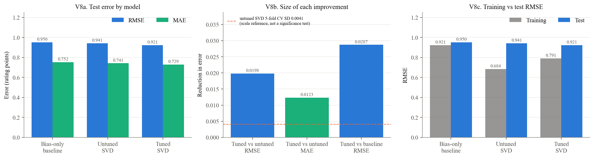

##### Observations: V8: Rating Accuracy

- Tuning reduces test RMSE from 0.941 to 0.921, an improvement of 0.0198 rating points, or 2.11%.
- Test MAE decreases from 0.741 to 0.729, an improvement of 0.0123 rating points.
- The tuned SVD's test RMSE is approximately 0.029 lower than that of the bias-only baseline.
- The tuned model has a training RMSE of 0.791 and a test RMSE of 0.921, giving a gap of approximately 0.131.
- The default SVD's CV standard deviation of 0.0041 describes variation across training folds. It does **not** measure uncertainty in the test-set improvement and is **not a significance test**.

#### 2.2 Prediction Distributions and Systematic Rating Errors

The following table and visualizations compare predictions with actual ratings. Signed error is calculated as predicted minus actual rating: positive values indicate overprediction, and negative values indicate underprediction.

| actual | mean predicted (untuned) | mean predicted (tuned) | n | mean signed error (tuned) | RMSE (tuned) |
| --- | --- | --- | --- | --- | --- |
| 1.0 | 2.7497836923647343 | 2.7701202756421828 | 1253 | 1.7701202756421828 | 1.896316450068969 |
| 2.0 | 3.0729660476498037 | 3.1006830704946964 | 2296 | 1.1006830704946966 | 1.2169767646448768 |
| 3.0 | 3.3576974858423703 | 3.3689246697248336 | 5507 | 0.3689246697248339 | 0.5980833685223659 |
| 4.0 | 3.695107328099916 | 3.684834628065429 | 6797 | -0.3151653719345706 | 0.5320898077065952 |
| 5.0 | 4.001928079214474 | 3.967301544431384 | 4147 | -1.032698455568616 | 1.1172649330773798 |

##### V9a. Tuned SVD predictions by true rating; V9b. Where each true rating lands (row %)

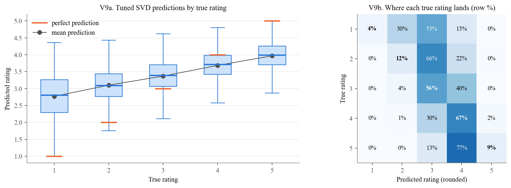

##### V10a. Predictions cluster between 3 and 4; V10b. Residual distribution on the test set

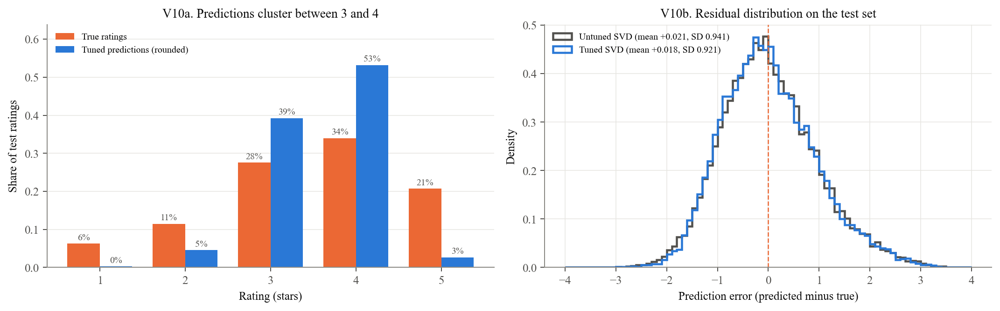

##### V11. Over-prediction of low ratings, under-prediction of high

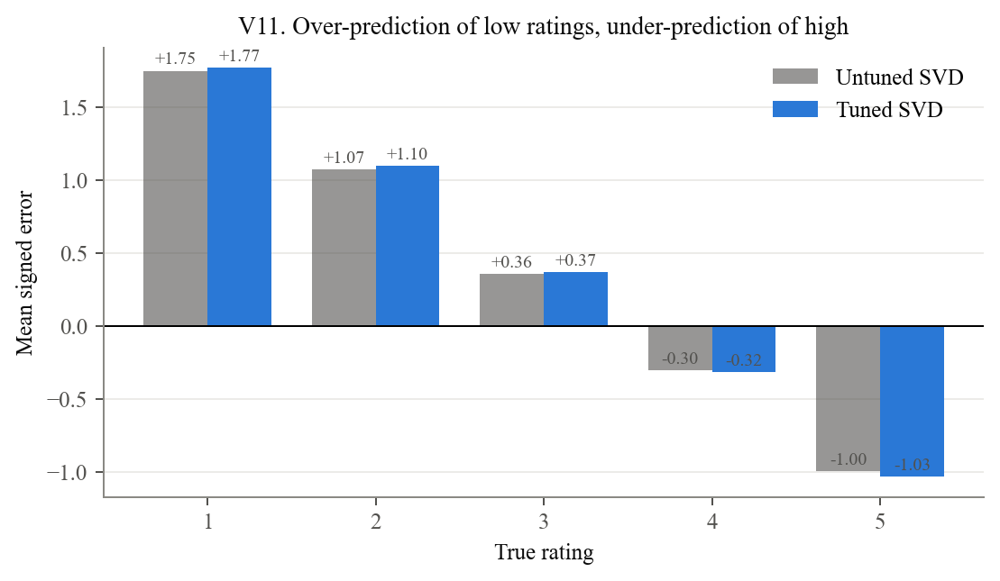

##### Observations: V9-V11: Prediction Distributions and Errors

- Predictions are concentrated near the middle of the rating scale. Their standard deviation is 0.58, compared with 1.13 for actual ratings.
- Ratings of 1 receive an average prediction of 2.77, an overprediction of 1.77 points.
- Ratings of 5 receive an average prediction of 3.97, an underprediction of approximately 1.03 points.
- The rounded-prediction matrix in V9b shows how each actual rating is distributed across predicted star values. Rounding is used only for visualization; RMSE and MAE use continuous predictions.
- V10 compares the rating distributions and residual distributions. A small overall mean residual can conceal substantial errors within individual rating categories.
- V11 shows the direction of error at each actual rating. Errors are generally larger away from the middle of the scale.
- This pattern is consistent with predictions being pulled toward the mean. These plots do not isolate the separate effects of the loss function, regularization, and limited training information.

#### 2.3 Error Heterogeneity by Training Support

Training support is the number of training ratings associated with a user or movie. Test ratings are divided into approximately equal-sized groups according to these counts. These are groups of **test ratings**, not equal-sized groups of distinct users or movies.

| Model / Group | Untuned SVD | Tuned SVD | n |
| --- | --- | --- | --- |
| 11-59 | 0.9873586043536992 | 0.9646038658500528 | 4076 |
| 60-115 | 0.9523024739536072 | 0.9311289356129788 | 3958 |
| 116-171 | 0.925754715998802 | 0.9036726800629052 | 3969 |
| 172-243 | 0.9139631784741512 | 0.896136049789852 | 4087 |
| 244-603 | 0.9238783892304256 | 0.9088485878475828 | 3910 |

| Model / Group | Untuned SVD | Tuned SVD | n |
| --- | --- | --- | --- |
| 0-48 | 1.0055829985773146 | 0.9819910758044786 | 4055 |
| 49-93 | 0.9332443719278652 | 0.9130970060351554 | 3990 |
| 94-137 | 0.9167942846625198 | 0.902523910417672 | 3994 |
| 138-208 | 0.9025887837285416 | 0.8813305921836544 | 3985 |
| 209-477 | 0.9431791833059971 | 0.923586282359742 | 3976 |

##### V12a. Users: RMSE by training volume; V12b. Movies: RMSE by training volume; V12c. Per-user RMSE (users with 5+ test ratings)

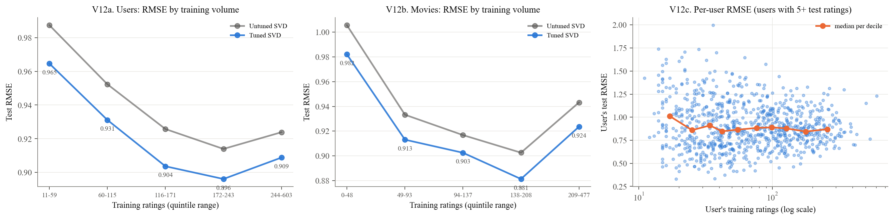

##### Observations: V12: Error by Training Support

- The group of test ratings associated with users who have 11-59 training ratings has RMSE 0.965. The other user-support groups range from 0.896 to 0.931.
- The group associated with movies that have 0-48 training ratings has RMSE 0.982. The other movie-support groups range from 0.881 to 0.924.
- The lowest-support groups have the highest errors, but error does not decrease steadily across every successive group.
- V12a and V12b compare the tuned and default models within the same support groups.
- V12c shows variation in individual users' RMSE at each activity level. Only users with at least five test ratings are included; their individual estimates can still be noisy.

#### 2.4 Case Analysis of the Largest Prediction Errors

The next table and chart examine the 12 test ratings with the largest absolute prediction errors. User and movie training counts provide context for these cases.

| Model / Group | user_id | title | actual | predicted | abs_err | item_train_ratings | user_train_ratings |
| --- | --- | --- | --- | --- | --- | --- | --- |
| 0 | 405 | Another Stakeout (1993) | 5.0 | 1.253871839798531 | 3.746128160201469 | 15 | 603 |
| 1 | 270 | Jerry Maguire (1996) | 1.0 | 4.360578815048327 | 3.360578815048327 | 303 | 114 |
| 2 | 148 | Amadeus (1984) | 1.0 | 4.318727306069631 | 3.318727306069631 | 223 | 50 |
| 3 | 363 | World of Apu, The (Apur Sansar) (1959) | 1.0 | 4.31663887964281 | 3.3166388796428103 | 5 | 243 |
| 4 | 159 | English Patient, The (1996) | 1.0 | 4.2812868327870826 | 3.2812868327870826 | 385 | 86 |
| 5 | 186 | Usual Suspects, The (1995) | 1.0 | 4.265065648008974 | 3.2650656480089744 | 218 | 77 |
| 6 | 592 | Fantasia (1940) | 1.0 | 4.260014174381294 | 3.2600141743812943 | 137 | 301 |
| 7 | 867 | Leaving Las Vegas (1995) | 1.0 | 4.257509707023172 | 3.257509707023172 | 235 | 79 |
| 8 | 72 | Empire Strikes Back, The (1980) | 1.0 | 4.2525513583075165 | 3.2525513583075165 | 290 | 112 |
| 9 | 887 | Little Princess, A (1995) | 1.0 | 4.22179746471563 | 3.22179746471563 | 30 | 137 |
| 10 | 310 | Tetsuo II: Body Hammer (1992) | 1.0 | 4.219564267367346 | 3.219564267367346 | 4 | 17 |
| 11 | 605 | Raising Arizona (1987) | 1.0 | 4.2046982136163225 | 3.2046982136163225 | 204 | 76 |

##### V13. The 12 largest test errors

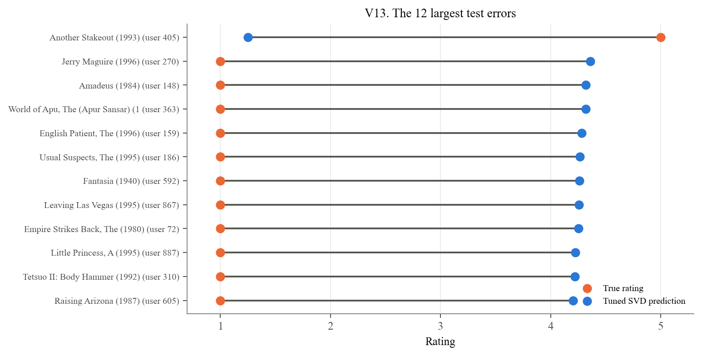

##### Observations: V13: Largest Individual Errors

- The largest errors include ratings for *Another Stakeout*, *Jerry Maguire*, *Amadeus*, *The World of Apu*, and *The English Patient* in the saved results.
- Each connecting line shows the difference between an actual rating and the model's prediction. A longer line indicates a larger error.
- Training counts help distinguish cases with limited supporting data from errors involving well-established users or movies.
- These selected cases illustrate model failures; they do not establish how common each failure type is or prove its cause.

#### 2.5 Model Improvement Priorities and Validation Strategy

- **Limited training support:** Evaluate stronger shrinkage for sparse profiles or additional information, such as movie genres. A larger movie-bias penalty (`reg_bi`) is one option to test.
- **Errors at extreme ratings:** Report performance by actual rating and consider validation criteria that reflect the intended recommendation task.
- **Ranking quality:** Include ranking metrics in future model selection when the intended output is a recommendation list.
- **Search boundaries:** Test values beyond the remaining boundaries and compare alternatives using training-based validation.
- **Evaluation discipline:** Assess proposed changes using training-based validation. The current held-out test results should not be used to choose new settings.

#### 2.6 Ranking Evaluation: Candidate Set, Precision, and Recall

The candidate set contains only the movies each user rated in the test partition.

- A movie is **recommended** if it is among that user's ten highest predicted ratings and its predicted rating is at least 4.
- A movie is **relevant** if its actual rating is at least 4.
- **Precision@10** is the proportion of qualifying recommendations that are relevant. Its denominator can be less than ten because of the predicted-rating cutoff.
- **Recall@10** is the proportion of relevant test items that appear among the qualifying recommendations.
- Users with no qualifying recommendations receive zero precision. Users with no relevant test items receive zero recall.
- The reported values are averages of the per-user metrics over 942 users.

The implementation follows the threshold-based definition used in Surprise's FAQ.

| Model / Group | precision@10 | recall@10 | users |
| --- | --- | --- | --- |
| Bias-only baseline | 0.5956593536211371 | 0.2490307264820112 | 942.0 |
| Untuned SVD | 0.6192397128702861 | 0.2817053920348896 | 942.0 |
| Tuned SVD | 0.5962347925723722 | 0.261447476966979 | 942.0 |

| k | precision@k: Bias-only baseline | precision@k: Untuned SVD | precision@k: Tuned SVD |
| --- | --- | --- | --- |
| 1 | 0.6167728237791932 | 0.643312101910828 | 0.6104033970276008 |
| 3 | 0.6059801840056617 | 0.6303963198867657 | 0.606687898089172 |
| 5 | 0.6007607926397734 | 0.6282908704883227 | 0.6011323425336164 |
| 10 | 0.5956593536211371 | 0.6192397128702861 | 0.5962347925723722 |
| 15 | 0.5935679206379845 | 0.6163555482026819 | 0.5945582666920246 |
| 20 | 0.5924438265521808 | 0.6144408082127462 | 0.5923419402612773 |

##### V14a. Ranking quality at k = 10 (higher is better); V14b. Precision@k; V14c. Recall@k

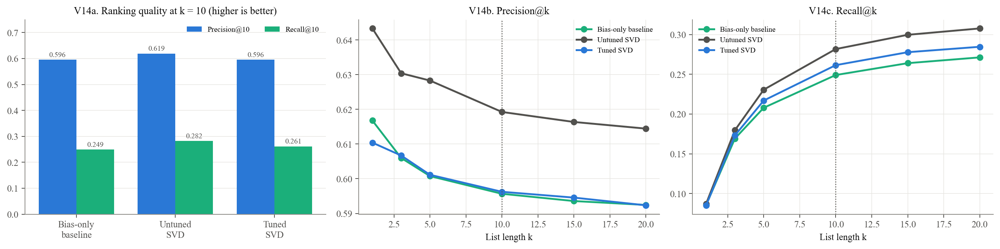

##### V15a. Distribution of per-user precision@10; V15b. Per-user change in precision@10 from tuning

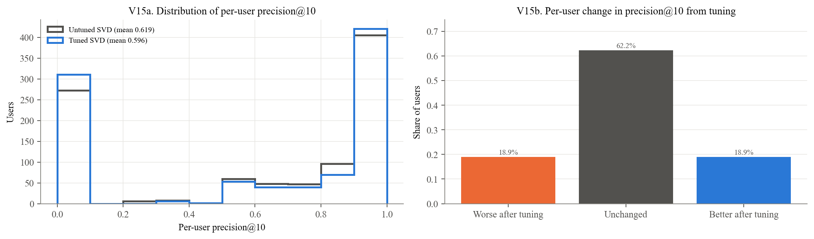

##### Observations: V14 and V15: Ranking Performance

- Precision@10 decreases from 0.619 for the default SVD to 0.596 for the tuned SVD.
- Recall@10 decreases from 0.282 to 0.261. Lower rating error therefore does not correspond to better performance on these ranking metrics.
- Selection minimizes CV RMSE rather than precision or recall. Compressed predictions can leave relevant items below the cutoff of 4 and reduce recall.
- Precision depends on which items exceed that cutoff. The zero-precision convention for users with no qualifying recommendations also affects the average.
- These mechanisms are possible contributors to the decline; their individual effects were not isolated experimentally.
- V14b and V14c compare performance across list lengths, while V15 shows how changes in precision are distributed across users.

**Candidate-set limitation**

- Every candidate in this evaluation is an item the user chose to rate. The results do not measure ranking quality over all available movies.
- The next analysis considers movies present in training that the user has not rated in training. Those lists may include held-out rated movies, exclude movies absent from training, and do not apply the predicted-rating cutoff of 4.

#### 2.7 Catalog Exposure and Recommendation Reliability

For each training user, the model ranks all movies present in training except those that the user rated in training. The ten highest-scoring candidates form the recommendation list. The analysis examines the amount of evidence supporting these recommendations and how widely particular movies are recommended.

| Model / Group | recs to thin-evidence movies | distinct movies recommended | catalog coverage | most-recommended movie | its share of users' lists |
| --- | --- | --- | --- | --- | --- |
| Untuned SVD | 0.0014846235418875 | 249 | 0.1480380499405469 | Wrong Trousers, The (1993) | 0.7073170731707317 |
| Tuned SVD | 0.5650053022269353 | 139 | 0.0826397146254458 | Pather Panchali (1955) | 0.9734888653234358 |

##### V16a. Evidence behind each recommendation; V16b. Recommendations to thin-evidence movies; V16c. Tuned SVD's most-recommended movies (orange = fewer than 10 training ratings)

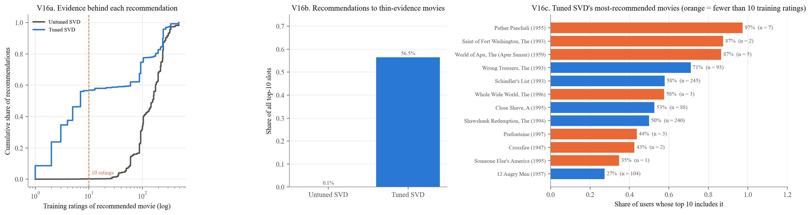

##### Observations: V16: Evidence Supporting Catalog Recommendations

- In the saved run, 56.5% of the tuned model's recommendation slots go to movies with fewer than ten training ratings, compared with approximately 0.1% for the default SVD.
- *Pather Panchali*, with seven training ratings, appears in approximately 97% of users' lists. *The Saint of Fort Washington*, with two training ratings, appears in approximately 87%.
- V16a shows the cumulative share of recommendations by movie training count. V16b summarizes recommendations to sparsely rated movies, and V16c shows the most widely recommended titles.
- These exposure statistics describe catalog-wide lists. They are separate from precision and recall calculated using held-out rated items.
- Broad exposure based on very few ratings raises questions about reliability and recommendation diversity, which can inform the report's Ethical Considerations section.
- The percentages above describe the saved run. This notebook recomputes the lists; small differences can occur across numerical-library builds when candidate scores are nearly tied.

#### 2.8 Temporal Evaluation and Cold-Start Limitations

A random split can place ratings in training that occur after the ratings being predicted. Two chronological alternatives examine the sensitivity of the results to the evaluation protocol:

- **Per-user chronological split:** Each user's latest 20% of ratings are held out. Later ratings from other users may still be included in training.
- **Global chronological split:** Ratings are divided at a common chronological boundary. This removes later-dated training information but leaves many test users without training histories.
- **Fixed configuration:** The selected hyperparameters are reused for these comparisons; the model is not retuned for each split.

Differences between these splits reflect changes in available information and test-set composition. They do not isolate the effect of temporal leakage.

| split | future info share | Bias-only baseline RMSE | Tuned SVD RMSE | new-user share | Tuned RMSE returning users | Tuned RMSE new users |
| --- | --- | --- | --- | --- | --- | --- |
| random | 0.97995 | 0.9500460954576448 | 0.921333753230372 | 0.0 | 0.921333753230372 |  |
| user_chrono | 0.9443599430842452 | 0.9981625533769962 | 0.971509125089494 | 0.0 | 0.971509125089494 |  |
| global_chrono | 0.0 | 1.0299917567528158 | 1.0208103467651612 | 0.8524 | 0.978806564275158 | 1.027909320701592 |

##### V17a. Test RMSE by split; V17b. What each split leaks or withholds; V17c. Global split: returning vs new users

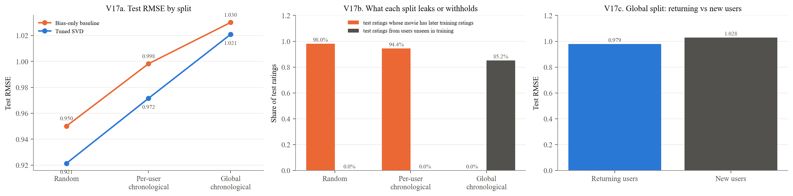

##### Observations: V17: Chronological Evaluation

- Tuned SVD RMSE is 0.921 on the random split, 0.972 on the per-user chronological split, and 1.021 on the global chronological split.
- The global-split RMSE is 10.8% higher than the random-split RMSE.
- On the random split, 98.0% of test ratings concern movies with later-dated ratings in training.
- The per-user split retains this form of future information for 94.4% of test ratings because other users' later ratings can remain in training.
- On the global split, 85.2% of test ratings come from users absent from training. RMSE is 1.028 for these users and 0.979 for returning users.
- The tuned model's RMSE advantage over the bias-only baseline narrows from approximately 0.029 on the random split to 0.009 on the global split.
- The global result is strongly influenced by cold-start users. The difference from the random split should not be interpreted as a pure estimate of leakage.
- Together, these results suggest that the random-split score may be optimistic for deployment. Evaluation-protocol limitations are discussed by Campos et al. (2014).

#### 2.9 Consolidated Evaluation Tables

| Model / Group | RMSE | MAE | Precision@10 | Recall@10 |
| --- | --- | --- | --- | --- |
| Bias-only baseline | 0.95 | 0.752 | 0.596 | 0.249 |
| Untuned SVD | 0.941 | 0.741 | 0.619 | 0.282 |
| Tuned SVD | 0.921 | 0.729 | 0.596 | 0.261 |

| split | Test RMSE | Test ratings with later training ratings of the same movie | Test ratings from users unseen in training |
| --- | --- | --- | --- |
| random | 0.921 | 0.98 | 0.0 |
| user_chrono | 0.972 | 0.944 | 0.0 |
| global_chrono | 1.021 | 0.0 | 0.852 |

#### 3.1 Numerical Verification and Interpretation Limits

The following table checks 64 numerical claims used in the report against the values available in this notebook, using the report's rounding conventions.

- **OK:** The value matches the report at the stated precision.
- **DIFF:** The value differs and should be investigated before submission.
- Most checks use recomputed evaluation results or the search surfaces selected by `RUN_FULL_SEARCH`. The default-model CV standard deviation is read from the saved evaluation summary.
- A mismatch may reflect differences in inputs, software versions, or execution. It should not automatically be dismissed as a software-version issue.
- Matching values confirm numerical consistency; they do not establish statistical significance or validate every interpretation in the report.

- [Complete audit of 64 numerical claims](notebook_figures/cell_66_table_18.csv). All 64 checks passed in the saved rendering run.
